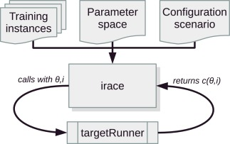

# Automatic configuration of Spark parameters using Irace

## Introduction

The Apache Spark is a set of open source tools widely used for distributed processing of large volume of data. It has more than 180 parameters with their respective domains which can be configurated when an application starts. The most appropriate choice of value for each parameter allows optimizing code execution, decreasing the processing costs which is associated to availability of computing resources. However the right choice of parameters is hard to do manually due to high number of possible combinations, which can be a limitation in the search for the best set of parameters.

The irace package is a algorithm that implements the iterated racing and it is used for optimize an application by chosing the best parameters configuration automatically. Given a set of parameters and a range of values from their domains, the irace execute the target runner several times in order to find the best combination considering the cost definied in the application. 




## Features

This project provides:

1. Spark application 
   An _word count_ application was developed in order to manipulate data from a log file and save it in a table from cassandra database.
2. Irace configuration
   The files containing the parameters considered, a scenario, first configuration and instances.
3. Irace configuration test
   In order to test the bests configuration found by Irace, an script was developed to run the application 10 times for each configuration in order to calculate the mean time.

## Installation

Clone this repository and follow the steps described on this [documentation](https://docs.google.com/document/d/1qMOu4mEjNGpoYA9r1__tG0eXXf3YvdT1iMvZw3rufyg/edit) to install the Irace package, the correct version of Spark and the Casssandra database.

## Usage

In the scenario's folder, run the command to init irace and append the output in a file:

```
nohup irace >> irace.log &
```

To follow the execution, run the command:

```
tail -f irace.log
```